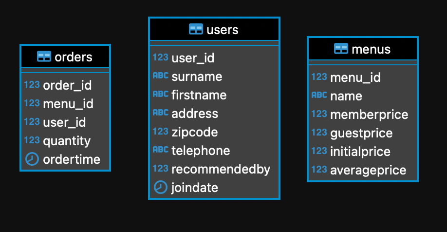
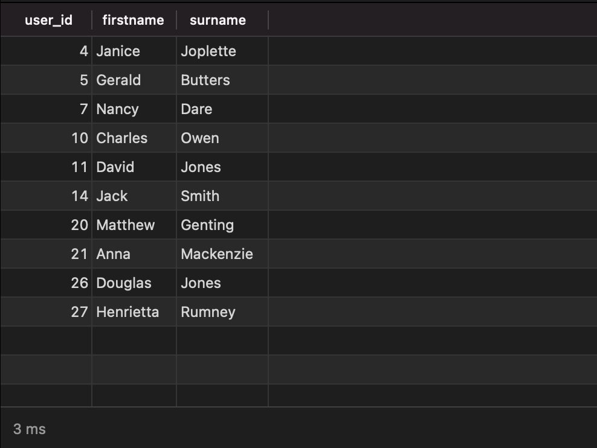

# Database
We have these three tables used in application:



users: For storing users

menus: For storing menus

orders: For storing orders


# Case 1
We have performance issue in our application, and after we dig and investigate query, we found this interesting result:


```sql
Sort (cost=3808.32..3839.15 rows=12332 width=446) (actual time=416.490..481.491 rows=16352 loops=1)
  Sort Key: o.ordertime, u.user_id DESC
  Sort Method: quicksort &nbsp;Memory: 1662kB
  ->  Nested Loop (cost=0.00..481.85 rows=12332 width=446) (actual time=0.136..316.869 rows=16352 loops=1)
"     Join Filter: (((u.firstname)::text = 'David'::text) OR ((u.firstname)::text = 'Smith'::text) OR ((u.surname)::text = 'Farrell'::text) OR (((u.surname)::text = 'Tracy'::text) AND (u.user_id = o.user_id)))"
    Rows Removed by Join Filter: 3868
    ->  Seq Scan on orders o (cost=0.00..66.44 rows=4044 width=24) (actual time=0.027..16.957 rows=4044 loops=1)
    ->  Materialize (cost=0.00..11.02 rows=4 width=840) (actual time=0.004..0.025 rows=5 loops=4044)
      ->  Seq Scan on users u &nbsp;(cost=0.00..11.00 rows=4 width=840) (actual time=0.015..0.068 rows=5 loops=1)
"           Filter: (((firstname)::text = 'David'::text) OR ((firstname)::text = 'Smith'::text) OR ((surname)::text = 'Farrell'::text) OR ((surname)::text = 'Tracy'::text))"
          Rows Removed by Filter: 26
Planning time: 0.152 ms
Execution time: 549.490 ms
```

1. What information we can extract from this query planner result ? please explain
2. How we can optimize the query based on this result.


# Case 2
In our system we are introducing referral. We store this information in users tables, column : recommended by.

Todo: Write query to find the downward recommendation chain for user ID 1: that is, the users they recommended, the users those users recommended, and so on. Return user ID and name, and order by ascending user_id.

Below are the expected result:



# Case 3
Our orders table growing bigger over the time. and now the size is ~10 TB. Thousand records being inserted and updated within seconds.

In some point, we want to add new index to ordertime column.

Question: What is the best approach to apply this new index with minimum impact.
